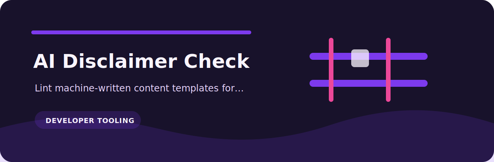
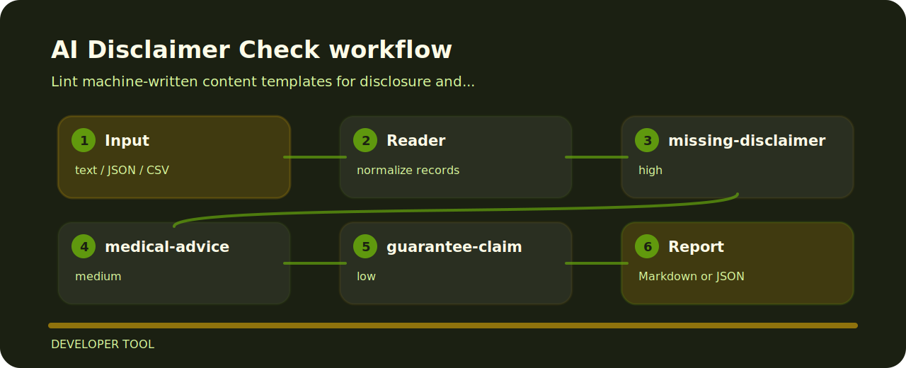

# AI Disclaimer Check

Lint machine-written content templates for disclosure and unsupported-claim gaps.



## Policy flow



## Checks in plain language

- `missing-disclaimer` - AI disclosure missing (high); add appropriate disclosure.
- `medical-advice` - medical advice phrase detected (medium); route to safe domain policy.
- `guarantee-claim` - guarantee language detected (low); soften unsupported guarantees.

## Files to open first

```text
.github/        CI workflow
examples/       sample inputs
src/            package source
tests/          test coverage
```

## One-pass run

```bash
git clone https://github.com/mertefekurt/ai-disclaimer-check.git
cd ai-disclaimer-check
python -m pip install -e ".[dev]"
ai-disclaimer-check examples/sample.txt
```
